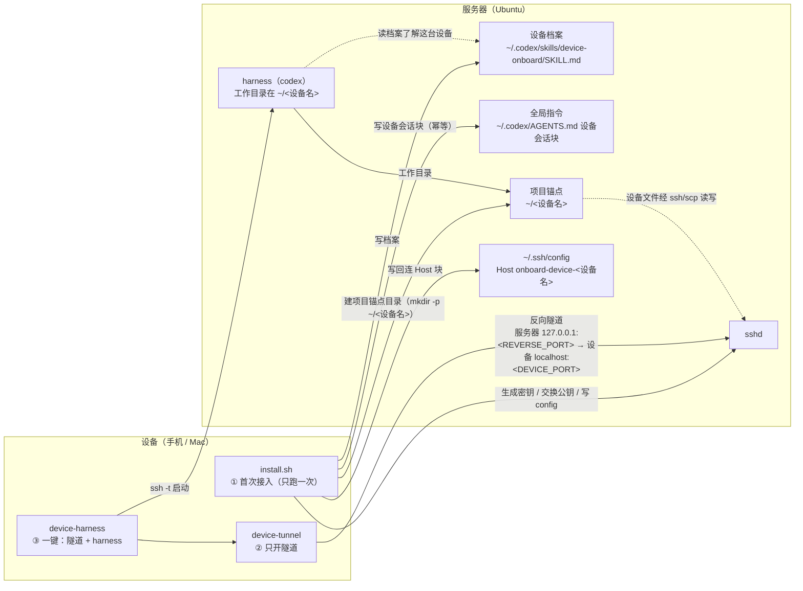
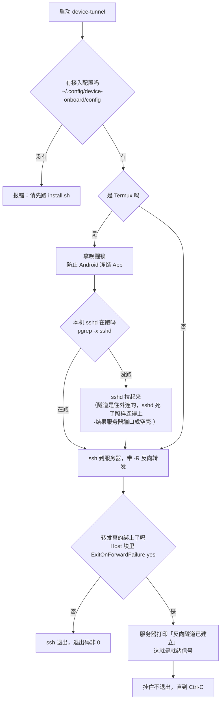
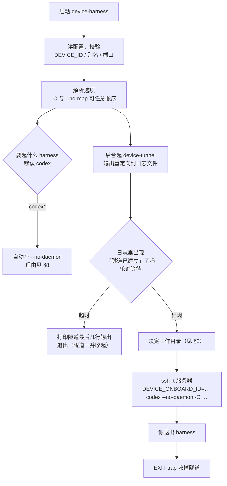
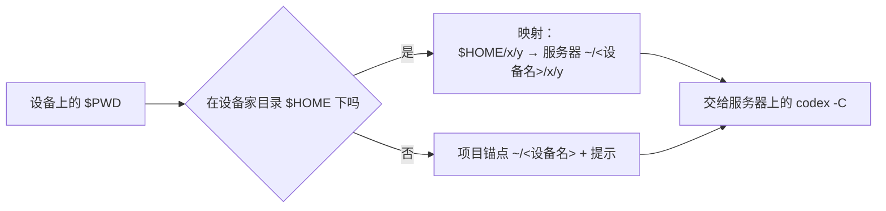

# device-onboard 运行流程

这份文档讲清三件事：**首次接入装了什么**、**日常两条命令各自干了什么**、**出错时怎么退**。
内容对应分支 `termux-port` 的实际代码（`install.sh`、`bin/device-tunnel`、`bin/device-harness`）。

---

## 0. 三个角色

| 角色 | 是什么 | 例子 |
|---|---|---|
| **设备** | 你想"从它出发干活"的那台机器 | 手机（Termux）、Mac |
| **服务器** | 常开、算力大、真正跑 harness 的那台 | 腾讯云 Ubuntu |
| **harness** | 服务器上真正干活的东西，默认 codex | codex |

方向约定：

- **正控**：设备 → 服务器（`ssh onboard-server-<设备名>`）
- **反控**：服务器 → 设备（靠设备先开一条反向隧道，再用 `ssh onboard-device-<设备名>`）

设备是**主动方**：所有连接都由设备发起。服务器不需要能直接访问设备。

---

## 1. 总览



---

## 2. 首次接入：`install.sh`（在设备上跑）

```mermaid
sequenceDiagram
    participant U as 你
    participant D as 设备（install.sh）
    participant S as 服务器

    D->>D: detect_platform()<br/>Darwin → macos；Termux → termux
    U->>D: 输入服务器 IP / 用户名 / 端口
    D->>S: ssh 登录（密码由你手输，脚本不存密码）
    D->>D: 生成密钥对（本地）
    D->>S: 追加公钥到服务器 authorized_keys
    S->>D: 回传服务器的公钥
    D->>D: 写进设备 authorized_keys
    D->>D: 写设备侧 ~/.ssh/config<br/>Host onboard-server-&lt;设备名&gt;
    S->>S: 写服务器侧 ~/.ssh/config<br/>Host onboard-device-&lt;设备名&gt;（含 RemoteForward）
    D->>S: 建设备档案到 ~/.codex/skills/device-onboard/
    D->>S: 写 ~/.codex/AGENTS.md 设备会话块（幂等）
    D->>S: 反向通道真握手验证
    Note over D,S: 让服务器在探测端口上主动连回设备一次<br/>必须回显 DEVICE-ONBOARD-E2E-OK 才算通
    D->>S: 建项目锚点目录 ~/&lt;设备名&gt;（mkdir -p + chmod 755）
    D->>U: 完成，打印用法
```

### 关键点

- **密码由你手输**，脚本不保存、不落盘。
- **端到端验证**：不是"绑上端口就算通"，而是让服务器**真连回来握一次手**——
  绑上但握手失败会立刻中止，并明确告诉你"换端口没用"。
- **项目锚点目录 `~/<设备名>` 由接入时幂等创建**（`mkdir -p` + `chmod 755`），是设备的身份锚点、
  也是 harness 的默认工作目录；设备里的文件改用 `ssh onboard-device-<设备名>` / `scp` 读写。
- **`~/.codex/AGENTS.md` 用独立标记块维护**：块已存在就整体替换、不存在就追加、文件不存在就创建，
  块以外的内容一律不动；回滚不管它。`DEVICE_ONBOARD_AGENTS_MD=0` 可跳过。
- **首次接入路径带失败回滚**：半路挂了会按标记撤销、还原备份。
- **"已有配置"重跑会走跳过路径**，那条路径**绝不改动** `~/.ssh/config`。

---

## 3. 日常之一：`device-tunnel`（在设备上跑）

只做一件事：**把服务器的某个端口，转发到设备的 sshd**。保持前台，Ctrl-C 结束。



> **为什么就绪信号必须由服务器说？** 因为只有服务器的 `sshd` 真把端口绑上了，
> 才可能执行到那行打印。本地瞎报"已建立"没有意义。

---

## 4. 日常之二：`device-harness`（一键，在设备上跑）

```
device-harness [--no-map] [-C <服务器上的目录>] [harness 命令] [命令参数...]
```

它是**编排层**：把隧道和 harness 的生命期绑在一起，干完自动收拾。



## 5. 工作目录是怎么定的（优先级从高到低）

| 情况 | 工作目录 | 说明 |
|---|---|---|
| 显式 `-C <目录>` | 用它 | 只做 `~` → `$HOME` 的转换，交给服务器展开 |
| `--no-map` | 项目锚点 `~/<设备名>` | 不跟随本机目录，但仍落在设备根（身份靠位置） |
| 默认，且 `$PWD` 在设备家目录下 | 服务器 `~/<设备名>/<相对路径>` | 自动映射 |
| 默认，但 `$PWD` 不在设备家目录下 | 项目锚点 `~/<设备名>` + 提示 | 比如手机上的 `/sdcard/...` |

**身份靠位置**：设备的身份由工作目录里的设备名编码。所以任何「没给 `-C`」的落点都在
`~/<设备名>`，**绝不落到共享的服务器家目录 `$HOME`**——否则「本次会话来自哪台设备」这个
信息就丢了。只有显式 `-C` 才由你说了算。



**这个目录是"身份锚点"而不是"同步副本"**：服务器上的 `~/<设备名>` 是一个普通目录，
只用来标记"本次会话属于哪台设备"、并作为 harness 的默认工作目录。设备里的文件**不**在这里，
要用 `ssh onboard-device-<设备名>` / `scp` 直接读写设备。

---

## 6. 项目锚点目录 `~/<设备名>`

- **它是什么**：服务器上一个**普通目录**，由接入时幂等创建（`mkdir -p` + `chmod 755`）。
  它不再挂任何东西，但**要保留**——设备的身份由目录位置编码。
- **它有什么用**：作为这台设备在服务器上的"项目锚点"，也是服务器上 harness 的默认工作目录。
  有 `DEVICE_ONBOARD_ID` 时 harness 的落点就在 `~/<设备名>`，一眼能看出会话来自哪台设备。
- **设备里的文件怎么读**：不再同步文件，直接用
  `ssh onboard-device-<设备名> '<命令>'` 或 `scp` 读写设备，简单直接。

---

## 7. 出错时的退路

- **隧道自检**：起隧道前确认设备 sshd 在跑，避免"端口绑上、却连不回设备"的空壳隧道。
- **身份不丢**：任何自动映射的落点都在 `~/<设备名>`，绝不落到共享的服务器家目录。

对应用户能看到的：

- 起隧道时设备 sshd 没跑 → `本机 sshd 没在跑，先拉起来…`
- 隧道迟迟不就绪 → 打印隧道最后几行输出并退出（隧道一并收起）。

---

## 8. 两个"看起来多余"的设计，其实都是踩出来的

**① 为什么 codex 要带 `--no-daemon`**

交互式 Codex 把"执行工具命令"交给一个常驻的 `app-server` 守护进程，
那个进程继承的是**它启动那一刻**的环境。于是 `DEVICE_ONBOARD_ID` 这类
本次会话才有的变量，传不到 Codex 的工具手上（实测：工具 shell 里的
`SSH_CLIENT` 与两天前那个守护进程逐字一致）。`--no-daemon` 让工具在**本次会话
进程**里执行，环境变量才有效。

**② 为什么就绪信号要由服务器打印**

本地"我发出去了"毫无意义——`ExitOnForwardFailure yes` 保证只有**服务器真的绑上端口**
才会执行到那行打印。这是唯一能区分"隧道通了"和"端口被占/没绑上"的证据。

---

## 9. 服务器侧看到什么

- **设备档案**：`~/.codex/skills/device-onboard/SKILL.md`
  —— 一个 skill 记所有设备，每台一个块；还有一个放在所有设备块之外的
  **共享约定块**，说明"本次会话来自哪台设备"以环境变量形式传进来
  （`DEVICE_ONBOARD_ID`、`DEVICE_ONBOARD_DEVICE_ALIAS`）。
- **全局指令**：`~/.codex/AGENTS.md` 里的「设备会话」标记块（设备接入时幂等写入；
  codex 只读这个文件，不读 `~/.agents/AGENTS.md`）
  —— 让 codex 一眼知道：有 `DEVICE_ONBOARD_ID` 就是设备会话、设备目录在 `~/<设备名>`，
  没有就是普通服务器会话，别瞎猜。
- **回连入口**：`~/.ssh/config` 里的 `Host onboard-device-<设备名>`
  （`127.0.0.1:<REVERSE_PORT>`）。
- **项目锚点目录**：`~/<设备名>`（普通目录；设备文件用 `ssh onboard-device-<设备名>` / `scp` 读写）。
- 于是服务器上的 harness 可以：读档案知道自己在谁的会话里、用
  `ssh onboard-device-<设备名> '<命令>'` 直接操作设备、在 `~/<设备名>` 这个项目锚点里干活（设备文件经 ssh/scp 读写）。

---

## 附：命令速查

| 想做什么 | 在哪跑 | 命令 |
|---|---|---|
| 首次接入 | 设备 | `sh install.sh` |
| 只开隧道 | 设备 | `device-tunnel` |
| 一键干活（跟随当前目录） | 设备 | `device-harness` |
| 一键干活（落在设备锚点目录 `~/<设备名>`） | 设备 | `device-harness --no-map` |
| 一键干活（指定服务器目录） | 设备 | `device-harness -C '~/xiaomi/项目'` |
| 进服务器 | 设备 | `ssh onboard-server-<设备名>` |
| 从服务器操作设备 | 服务器 | `ssh onboard-device-<设备名> '<命令>'` |
| 工作目录在设备锚点目录 | 服务器 | `codex -C ~/<设备名>` |
