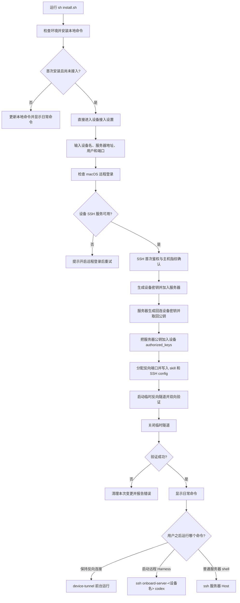

# Device Onboard MVP 规格

## 目标

在一台 macOS 设备上运行一个 shell 脚本，建立设备与服务器之间的双向 SSH 通道。服务器是唯一的 AI 开发节点：harness、skills 和项目都保存在服务器上。

## 范围

- 首版只支持 macOS。
- 客户端是一个独立的 POSIX shell 脚本，带简单的文字菜单。
- 网络只要求目标地址已经可以通过 SSH 访问，可以是局域网、公网或 VPN。
- 鉴权使用系统 SSH 处理密钥、SSH agent、主机指纹确认和密码提示。工具不保存密码。
- Harness 只在服务器运行。设备可以进入服务器 shell，也可以用独立命令启动远程 Harness。
- 反向隧道由用户手动以前台方式启动，使用 SSH Host 配置。

## 文件和别名

脚本只修改自己带标记的配置区块，并在修改前创建备份。

- 设备密钥目录：`~/.ssh/device-onboard/`
- 设备 SSH 配置：`~/.ssh/config`
- 服务器 SSH 配置：`~/.ssh/config`
- 唯一 skill：`~/.agents/skills/device-onboard/SKILL.md`

设备侧生成普通服务器连接和反向隧道两个 Host。服务器侧生成一个通过反向隧道回连设备的 Host。Harness 由菜单通过普通服务器 Host 执行远程命令启动，不为每个 Harness 单独生成 SSH Host。

## 设备记录

skill 只保存重新生成 SSH 配置所需的最小信息：

```text
device_name
server_host
server_user
server_ssh_port
device_ssh_port
reverse_port
device_key_name
server_key_name
```

skill 不保存任何私钥内容。

## 程序运行流程



## 安装与启动命令

安装脚本在首次运行时安装本地命令，并直接开始设备接入设置；它会连接服务器、交换密钥并写入 SSH 配置和设备档案。开发时在项目目录运行：

```sh
sh ./install.sh
```

安装地址确定并发布后，再把远程下载命令补在这里；目前不写虚构的 `curl` URL。安装后需要确保命令安装目录已加入 `PATH`。

接入成功后，日常使用以下命令：

```sh
device-tunnel
ssh onboard-server-<设备名> codex
ssh onboard-server-<设备名>
```

## 首次运行：输入与菜单

### 1. 启动与预检查

用户运行 `sh ./install.sh`。脚本检查当前系统是否为 macOS，并确认 `ssh`、`ssh-keygen` 可用、`~/.ssh` 可访问；随后安装 `device-tunnel` 和 `device-harness` 命令。首次安装且没有设备档案时，安装脚本直接进入接入菜单。

预检查失败时，脚本显示具体缺项并退出，不修改文件。

### 2. 首次接入菜单

```text
设备接入设置

1) 配置设备与服务器的 SSH 连接
0) 退出

请选择：
```

这个菜单由安装脚本在本地命令安装完成后显示。

### 3. 收集连接信息

```text
设备名称 [当前 Mac 主机名]：
服务器地址（IP 或域名）：
服务器 SSH 用户名：
服务器 SSH 端口 [22]：
```

设备名称默认使用 `scutil --get ComputerName`；服务器端口默认 `22`。服务器地址可以是局域网、公网或现有 VPN 中可达的地址。

脚本检查 macOS“远程登录”是否可用。若服务器需要回连本机，而远程登录未开启，脚本暂停并提示用户先在“系统设置 → 通用 → 共享 → 远程登录”开启，再选择继续检查或退出。

### 4. SSH 首次鉴权

脚本调用系统 `ssh` 连接服务器。第一次连接由 SSH 显示服务器主机指纹，用户确认后继续；如果已有 SSH key 或 SSH agent 可用则免输密码，否则 SSH 自己提示输入密码。程序不读取或保存密码。

### 5. 建立双向通道

脚本生成设备专用密钥并把公钥加入服务器。随后服务器生成专用回连密钥，脚本通过 SSH 取回公钥并加入设备的 `~/.ssh/authorized_keys`。这个步骤不需要反向隧道已经运行。

服务器侧在配置的端口范围内选择空闲反向端口。脚本只把私钥保存在产生它的一侧。

### 6. 写入配置并验证

脚本备份已有配置，只更新 `~/.ssh/config` 中自己标记的区块，并写入服务器的 `~/.agents/skills/device-onboard/SKILL.md` 设备记录。主机名已存在且身份不匹配时停止，不覆盖。

然后接入程序启动临时反向隧道，自动验证设备到服务器和服务器到设备的连接，验证后关闭临时隧道。两项都成功后显示结果和日常使用命令。这个临时隧道只用于首次配置，不会常驻。

如果用户中途退出或任一步失败，脚本移除本次新增的密钥授权、配置块和设备记录，并恢复本次改动前的备份。

## 接入成功后的命令

- `device-tunnel`：以前台方式启动反向 SSH 隧道，按 `Ctrl-C` 结束。
- `ssh onboard-server-<设备名> codex`：通过 SSH 在服务器启动 Codex；也可传入其他已安装在服务器上的 Harness 命令，例如 `ssh onboard-server-<设备名> claude`。
- `device-harness`：一键编排（起反向隧道 + 在服务器上跑 harness，默认 codex），隧道与 harness 同生共死。
- `ssh onboard-server-<设备名>`：进入普通服务器 shell。

本机已有一个名为 `tunnel` 的独立命令，因此新工具使用 `device-tunnel`，不覆盖现有命令。底层仍使用普通服务器 SSH Host，并配置 `RemoteForward`；命令以前台方式运行，端口冲突时立即失败，按 `Ctrl-C` 断开。接入程序还会通过服务器回连设备完成端到端检查。

生成的 SSH Host 使用固定前缀和设备名，例如：

```sh
ssh onboard-server-<设备名>
ssh -N onboard-tunnel-<设备名>
ssh onboard-server-<设备名> codex
```

Harness 通过普通服务器 Host 以交互式 SSH 启动，不为每个 Harness 单独生成一个 SSH Host。想要「起隧道 + 跑 harness」一步到位时用 `device-harness`：它负责隧道与 harness 两条进程的生命期，退出时一起收干净；SSH 断开后远程 Harness 进程随之结束。

## 流程边界

- 首次运行 `install.sh` 会安装本地命令并完成设备接入；检测到已有设备档案时只更新本地命令并显示日常命令。
- 反向隧道由 `device-tunnel` 前台运行，不后台保活。
- Harness 用普通服务器 Host（`ssh onboard-server-<设备名> <命令>`）启动，或用 `device-harness` 一键起隧道 + 跑 harness；首版不维护 Harness 注册表。
- 首次接入以外不做自动恢复；中断后重新运行脚本，从接入流程开始。
- 失败时清理本次新增内容；已有配置通过备份恢复。

## MVP 明确不做

首版不做多设备协同、后台隧道服务、自动恢复、包管理器安装、服务器 API、多平台抽象和复杂回滚系统。
